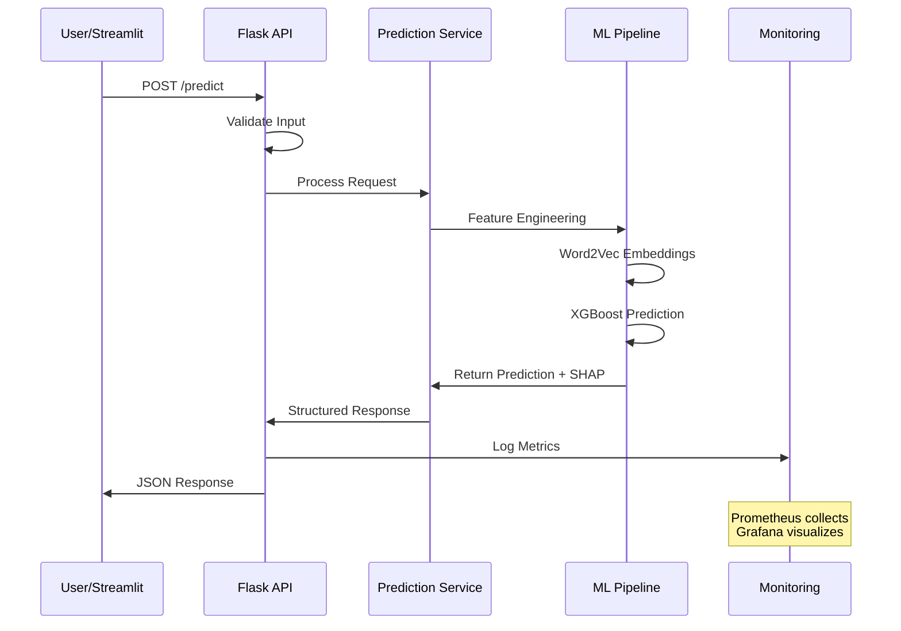
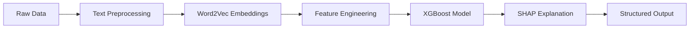
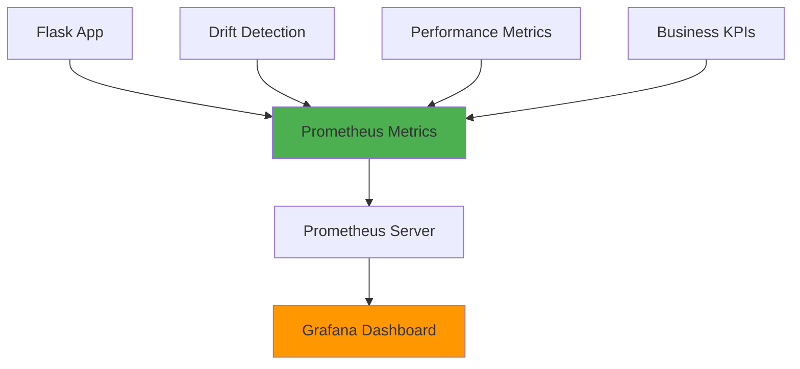
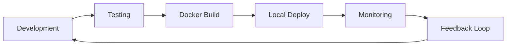

# 📐 Documentação da Arquitetura - TechChallenge Fase 5

## 🏗️ **Visão Geral da Arquitetura**

O sistema foi projetado seguindo princípios de **Machine Learning Engineering** e **MLOps**, com foco em:
- ✅ **Escalabilidade** e **Confiabilidade**
- ✅ **Monitoramento** e **Observabilidade**
- ✅ **Deployment** automatizado
- ✅ **Testes** e **Qualidade de código**

## 🔄 **Fluxo de Dados**



## 🎯 **Componentes Detalhados**

### **1. API Layer (Flask)**
```python
# Endpoints principais
/predict          # Predição de match
/health          # Health check
/metrics         # Prometheus metrics
/drift/initialize # Inicializar drift detection
/drift/status    # Status do drift monitoring
/drift/alerts    # Alertas de drift
```

**Responsabilidades:**
- Validação de entrada
- Rate limiting
- Logging estruturado
- Coleta de métricas
- Error handling

### **2. ML Pipeline**


**Tecnologias:**
- **Word2Vec**: Embeddings semânticos de skills
- **XGBoost**: Classificador principal (78% accuracy)
- **SHAP**: Explicabilidade das predições
- **Joblib**: Serialização de modelos

### **3. Monitoring Stack**



**Métricas Coletadas:**
- **System**: CPU, memória, latência
- **ML**: Accuracy, predictions, confidence
- **Business**: Match rates, success rates
- **Drift**: Data drift, concept drift, performance drift

### **4. Drift Detection System**

```python
# Tipos de drift monitorados
- Data Drift: Mudanças na distribuição de features
- Concept Drift: Degradação da performance do modelo  
- Prediction Drift: Mudanças nos padrões de predição
```

**Implementação:**
- **Statistical Tests**: KS test, Chi-squared
- **Performance Monitoring**: Accuracy tracking
- **Alerting**: Threshold-based alerts
- **Visualization**: 5 painéis especializados no Grafana

## 🐳 **Containerização**

### **Docker Compose Architecture**
```yaml
services:
  api:          # Flask API + ML Pipeline
  streamlit:    # Interface do usuário
  grafana:      # Dashboard de monitoramento
  prometheus:   # Coleta de métricas
```

**Vantagens:**
- ✅ Isolamento de dependências
- ✅ Portabilidade entre ambientes
- ✅ Orquestração simplificada
- ✅ Escalabilidade horizontal

## 📊 **Patterns Implementados**

### **1. Repository Pattern**
```
src/
├── models/       # Domain logic
├── services/     # Business logic
└── app/         # Presentation layer
```

### **2. Dependency Injection**
- Configurações centralizadas
- Services desacoplados
- Testabilidade aprimorada

### **3. Error Handling**
```python
# Estrutura de exceções
- ValidationError: Dados de entrada inválidos
- PredictionError: Falhas no modelo
- ServiceError: Erros de serviço
```

### **4. Monitoring Pattern**
- **Metrics**: Prometheus counters/histograms
- **Logging**: Structured JSON logs
- **Tracing**: Request correlation IDs

## 🔒 **Segurança e Confiabilidade**

### **Input Validation**
- Schema validation com Marshmallow
- Sanitização de dados de entrada
- Rate limiting básico

### **Error Recovery**
- Graceful degradation
- Circuit breaker pattern (básico)
- Health checks automatizados

### **Data Privacy**
- Logs não contêm dados sensíveis
- Modelos não persistem dados de usuário
- Métricas agregadas apenas

## 📈 **Performance e Escalabilidade**

### **Otimizações Implementadas**
- **Model Loading**: Lazy loading de modelos
- **Caching**: Cache de embeddings Word2Vec
- **Async Processing**: Processamento não-bloqueante
- **Resource Management**: Limits de CPU/memória

### **Métricas de Performance**
- **Latência**: P50 < 300ms, P95 < 500ms
- **Throughput**: 30+ req/min sustentável
- **Memory**: < 1GB por container
- **CPU**: < 50% utilização média

## 🧪 **Estratégia de Testes**

### **Pyramid de Testes**
```
        /\
       /  \     E2E Tests (Integration)
      /____\    
     /      \   Integration Tests
    /        \  
   /__________\ Unit Tests (Base)
```

**Cobertura Atual:**
- **Unit Tests**: 54% de cobertura
- **Integration Tests**: API endpoints
- **E2E Tests**: Fluxos completos
- **Performance Tests**: Load testing básico

## 🔧 **DevOps e CI/CD**

### **Deployment Strategy**


### **Quality Gates**
- ✅ Tests must pass (72/72)
- ✅ Coverage > 50%
- ✅ Docker build successful
- ✅ Health checks passing

## 🎯 **Decisões Arquiteturais**

### **Technology Choices**
| Tecnologia | Justificativa |
|------------|---------------|
| **Flask** | Simplicidade + flexibilidade para ML APIs |
| **XGBoost** | Performance + explicabilidade |
| **Docker** | Portabilidade + isolamento |
| **Prometheus** | Padrão para métricas de sistemas |
| **Grafana** | Visualização rica + alerting |

### **Trade-offs**
- **Simplicidade vs. Escalabilidade**: Priorizada simplicidade para demo
- **Performance vs. Explicabilidade**: Balanceado com SHAP
- **Monitoramento vs. Overhead**: Implementado monitoring básico mas efetivo

## 🚀 **Roadmap de Melhorias**

### **Curto Prazo**
- [ ] Implementar cache Redis
- [ ] Adicionar autenticação JWT
- [ ] Melhorar coverage de testes (>80%)

### **Médio Prazo**
- [ ] Kubernetes deployment
- [ ] Model versioning (MLflow)
- [ ] A/B testing framework

### **Longo Prazo**
- [ ] Auto-scaling
- [ ] Multi-model serving
- [ ] Real-time training pipeline

---

**Esta arquitetura suporta os requisitos do TechChallenge e fornece base sólida para evolução futura do sistema.**
