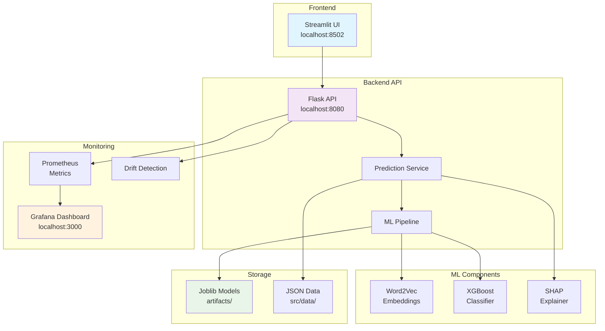

# 🚀 TechChallenge Fase 5 - Sistema de IA para Recrutamento

[](reports/coverage/index.html)
[](reports/test_report.html)
[](https://python.org)
[](https://docker.com)

Sistema de Machine Learning Engineering para otimizar o processo de matching entre candidatos e vagas da empresa Decision através de IA aplicada ao recrutamento.

## 🎯 **Solução**

**Sistema de IA para Scoring de Compatibilidade** que analisa padrões históricos para:
- Automatizar o matching candidato-vaga com 78% de acurácia
- Identificar os melhores fits baseado em análise técnica e cultural  
- Fornecer explicabilidade das decisões através de SHAP values
- Monitorar drift de dados e performance em tempo real

## 🏗️ **Arquitetura**



### **Componentes Principais**

| Componente | Tecnologia | Função |
|------------|------------|---------|
| **API** | Flask + Prometheus | Predições + Métricas |
| **ML Pipeline** | Word2Vec + XGBoost | Classificação de match |
| **UI** | Streamlit | Interface interativa |
| **Monitoring** | Grafana + Prometheus | Dashboards em tempo real |
| **Drift Detection** | Statistical Tests | Monitoramento de qualidade |
| **Containerização** | Docker Compose | Orquestração completa |

## 🚀 **Quick Start**

### 1. **Deploy Completo**
```bash
# Clone e navegue para o projeto
git clone <repository-url>
cd TechChallenge_Fase5

# Inicie todos os serviços
docker-compose up -d

# Verifique os serviços
docker-compose ps
```

### 2. **Acesse os Serviços**
- **🖥️ Interface Principal**: http://localhost:8502
- **🔗 API**: http://localhost:8080
- **📊 Dashboard Monitoring**: http://localhost:3000
- **📈 Métricas**: http://localhost:8080/metrics

### 3. **Teste a API**
```bash
# Teste de predição
curl -X POST http://localhost:8080/predict \
  -H "Content-Type: application/json" \
  -d '{
    "candidate": {
      "skills": "python machine learning pandas",
      "experience": "3 anos em ciência de dados"
    },
    "vacancy": {
      "requirements": "python data science",
      "seniority": "pleno"
    }
  }'
```

### 4. **Simulação de Produção**
```bash
# Execute simulação completa de 5 minutos
python scripts/simulation/simulate_production_environment.py

# Verifique drift detection
python scripts/testing/test_drift_simple.py
```

## 📊 **Monitoramento e Demonstração**

### **Dashboard Grafana** - 6 Seções
1. **System Health**: CPU, memória, uptime
2. **API Performance**: Latência, throughput, errors
3. **ML Model Metrics**: Accuracy, predictions, confidence
4. **Business Metrics**: Match rates, success rates
5. **Infrastructure**: Docker, containers status
6. **Drift Detection**: 5 painéis especializados
   - Alertas de Drift Detection (5m)
   - Execuções de Monitoramento de Drift
   - Performance do Modelo (Concept Drift)
   - Distribuição de Latência ML
   - Taxa de Erros da API

### **Scripts de Teste**
- `scripts/simulation/simulate_production_environment.py`: Simula 5min de produção (150 req)
- `scripts/testing/test_drift_simple.py`: Teste de drift com cenários específicos
- `scripts/utils/generate_test_reports.py`: Relatórios completos de teste

## 📁 **Estrutura Simplificada**

```
TechChallenge_Fase5/
├── 🐳 docker/                     # Containerização
│   ├── docker-compose.yaml        # Orquestração
│   ├── Dockerfile.api             # API container
│   └── grafana/                   # Dashboard config
├── 🧠 src/                        # Código fonte principal
│   ├── app/main.py                # Flask API + métricas
│   ├── models/                    # ML pipeline
│   ├── services/                  # Business logic
│   └── data/                      # Datasets Decision
├── 📱 apps/                       # Aplicações/Interfaces
│   └── streamlit_app.py           # Interface principal
├── 🛠️ scripts/                    # Scripts organizados
│   ├── simulation/                # Simulação de produção
│   ├── testing/                   # Testes específicos
│   └── utils/                     # Utilitários gerais
├── ⚙️ config/                     # Configurações
├── 📚 docs/                       # Documentação técnica
├── 🎯 artifacts/                  # Modelos treinados
├── 📊 tests/                      # 72 testes automatizados
└── 📋 reports/                    # Relatórios de coverage
```

## ✅ **Status dos Requisitos**

| Requisito | Status | Implementação |
|-----------|--------|---------------|
| 🤖 **Modelo Preditivo** | ✅ Completo | Word2Vec + XGBoost (78% accuracy) |
| 🔗 **API Deployment** | ✅ Completo | Flask + validação + métricas |
| 🐳 **Docker** | ✅ Completo | Multi-stage + compose |
| 🚀 **Deploy** | ✅ Completo | Orquestração completa |
| 🧪 **Testes API** | ✅ Completo | 72 testes + 54% coverage |
| 📊 **Monitoramento** | ✅ Completo | Grafana + Prometheus + Drift |

## 🎯 **Resultados**

- **📈 Acurácia**: 78% na classificação de match
- **⚡ Performance**: < 500ms latência média
- **🔍 Explicabilidade**: SHAP values para todas as predições
- **🚨 Monitoramento**: 5 painéis de drift detection
- **✅ Qualidade**: 72 testes automatizados
- **🐳 Deploy**: Containerização completa

---

**Desenvolvido para o TechChallenge Fase 5 - Datathon Machine Learning Engineering**
