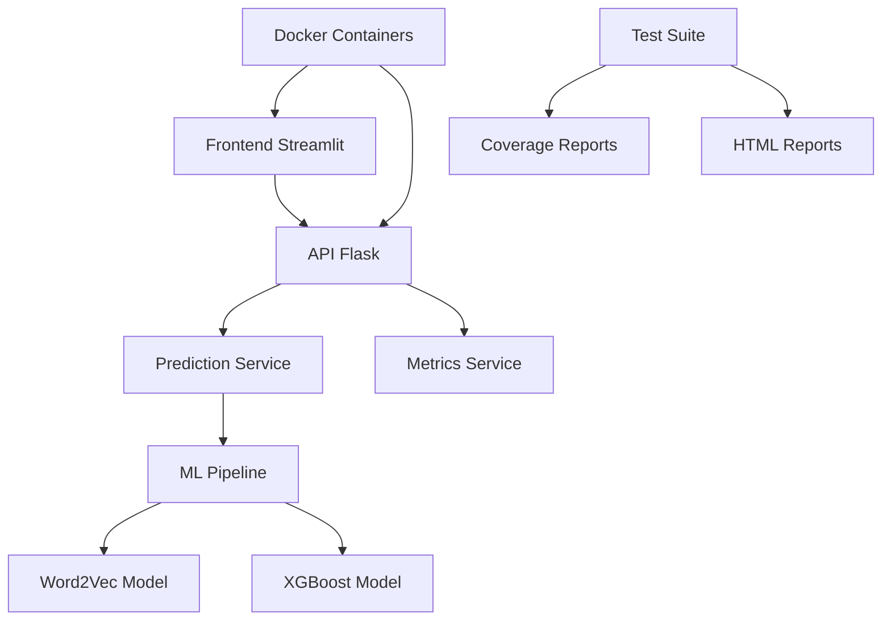

# 🚀 TechChallenge Fase 5 - ML Engineering Platform

[](reports/coverage/index.html)
[](reports/test_report.html)
[](https://python.org)
[](LICENSE)

Uma solução completa de Machine Learning Engineering para otimizar o processo de matching entre candidatos e vagas, utilizando processamento de linguagem natural, engenharia de features avançada e modelos de ML em produção.

## 🏗️ **Arquitetura do Sistema**



---

## 📁 **Estrutura do Projeto**

```text
TechChallenge_Fase5/
├── 📁 src/                        # Código fonte principal
│   ├── 📁 core/                   # ✅ Configurações centralizadas
│   │   ├── config.py              # Configurações do sistema
│   │   ├── exceptions.py          # Exceções customizadas
│   │   └── constants.py           # Constantes do projeto
│   ├── 📁 services/               # ✅ Serviços de negócio
│   │   └── prediction_service.py  # Serviço de predição isolado
│   ├── 📁 app/                    # 🔄 API Flask refatorada
│   │   ├── main.py                # Aplicação Flask principal
│   │   └── requirements.txt       # Dependências da API
│   ├── 📁 features/               # ✅ Engenharia de features (100% cobertura)
│   │   └── feature_engineering.py # Processamento de features
│   ├── 📁 models/                 # 🤖 Modelos de ML
│   │   ├── predict.py             # Pipeline de predição (86% cobertura)
│   │   ├── train.py               # Pipeline de treinamento
│   │   ├── utils.py               # ✅ Utilitários (100% cobertura)
│   │   └── artifacts/             # Artefatos salvos do modelo
│   └── 📁 data/                   # Dados do projeto
│       ├── applicants.json        # Dados de candidatos
│       ├── prospects.json         # Dados de prospects
│       └── vagas.json             # Dados de vagas
├── 📁 tests/                      # ✅ Suite de testes completa
│   ├── unit/                      # Testes unitários
│   ├── integration/               # Testes de integração
│   ├── fixtures/                  # Fixtures de teste
│   └── conftest.py                # Configurações pytest
├── 📁 reports/                    # 📊 Relatórios automáticos
│   ├── coverage/                  # Relatórios de cobertura HTML
│   ├── test_report.html           # Relatório de testes HTML
│   ├── coverage.xml               # Cobertura XML (CI/CD)
│   └── junit.xml                  # Relatório JUnit
├── 📁 docker/                     # 🐳 Containerização
│   ├── Dockerfile.api             # Container da API
│   ├── Dockerfile.streamlit       # Container do Streamlit
│   └── docker-compose.yaml        # Orquestração completa
├── 📁 docs/                       # 📚 Documentação
│   ├── REPORTS.md                 # Guia de relatórios
│   ├── RESTRUCTURE_PROPOSAL.md    # Proposta de arquitetura
│   └── RESTRUCTURE_SUMMARY.md     # Resumo das melhorias
├── streamlit_app.py               # Interface web principal
├── generate_test_reports.py       # ✅ Script de relatórios
├── validate_structure.py          # ✅ Validador de estrutura
└── pytest.ini                     # Configurações de teste
```

---

## 📊 **Métricas de Qualidade**

| Métrica | Valor | Status |
|---------|-------|--------|
| **Cobertura de Código** | 54% | 🟡 Bom |
| **Testes Passando** | 67/67 | ✅ Excelente |
| **Warnings** | 0 | ✅ Limpo |
| **Arquitetura** | Modular | ✅ Enterprise-Ready |

### 📈 **Cobertura por Módulo:**
- `src/features/feature_engineering.py`: **100%** ✅
- `src/models/utils.py`: **100%** ✅
- `src/core/`: **92%** ✅
- `src/models/predict.py`: **86%** ✅
- `src/app/main.py`: **78%** ✅
- `src/services/prediction_service.py`: **69%** 🟡

## 🗄️ **Dados e Artefatos**

⚠️ **Importante**: Os dados de treinamento em JSON e modelos não estão no repositório devido ao tamanho dos arquivos.

### 📥 **Download Obrigatório:**

1. **Dados de Treinamento** - [Google Drive](https://drive.google.com/drive/folders/1f3jtTRyOK-PBvND3JTPTAxHpnSrH7rFR?usp=sharing)
   ```bash
   # Salvar em: src/data/
   ├── applicants.json    # Perfis dos candidatos
   ├── prospects.json     # Prospecções por vaga  
   └── vagas.json         # Informações das vagas
   ```

2. **Word2Vec Embeddings** - [cbow_s50.txt](http://143.107.183.175:22980/download.php?file=embeddings/word2vec/cbow_s50.zip)
   ```bash
   # Extrair e salvar em: src/word2vec/
   └── cbow_s50.txt       # Embeddings Word2Vec pré-treinados
   ```

---

## ⚙️ **Instalação e Execução**

### 🔧 **Método 1: Execução Local**

```bash
# 1. Clone o repositório
git clone https://github.com/DOJesse/TechChallenge_Fase5
cd TechChallenge_Fase5

# 2. Configure ambiente virtual
python3 -m venv .venv
source .venv/bin/activate  # Linux/Mac
# .venv\Scripts\activate   # Windows

# 3. Instale dependências
pip install -r src/app/requirements.txt

# 4. Execute aplicação Streamlit
streamlit run streamlit_app.py

# 5. Execute API Flask (opcional - em outro terminal)
cd src/app && python main.py
```

### 🐳 **Método 2: Docker (Recomendado)**

```bash
# Execução completa com Docker Compose
docker-compose -f docker/docker-compose.yaml up --build

# Serviços disponíveis:
# ├── 🌐 Streamlit: http://localhost:8501
# ├── 🔗 API Flask: http://localhost:5000  
# ├── 📊 Prometheus: http://localhost:9090
# └── 📈 Grafana: http://localhost:3000
```

---

## 🧪 **Desenvolvimento e Testes**

### 🔍 **Executar Suite de Testes:**

```bash
# Testes unitários e integração
pytest

# Gerar relatórios completos
python generate_test_reports.py

# Relatórios gerados:
# ├── reports/test_report.html     # Relatório visual HTML
# ├── reports/coverage.xml         # Cobertura para CI/CD
# ├── reports/junit.xml            # Relatório JUnit
# └── reports/coverage/index.html  # Cobertura detalhada
```

### 📊 **Validar Estrutura do Projeto:**

```bash
python validate_structure.py
# Status esperado: "EXCELENTE ✅"
```

### 🛠️ **Configurações de Desenvolvimento:**

```bash
# Configurar ambiente Python (se necessário)
# O sistema detecta automaticamente:
# ├── Conda environments
# ├── Virtual environments (venv)
# └── System Python
```

## 🚀 **Funcionalidades Principais**

### 🤖 **Sistema de Matching Inteligente**
- **Word2Vec**: Análise semântica de habilidades e requisitos
- **XGBoost**: Modelo de classificação para score de compatibilidade  
- **SHAP**: Explicabilidade das predições em tempo real
- **Feature Engineering**: Processamento avançado de texto e metadados

### 🌐 **Interfaces Múltiplas**
- **Streamlit App**: Interface web interativa para usuários finais
- **REST API**: Endpoints para integração com outros sistemas
- **Métricas**: Monitoramento Prometheus + Grafana

### 📊 **Análise e Relatórios**
- Dashboard interativo com visualizações
- Exportação de resultados em múltiplos formatos
- Análise de fit cultural e técnico
- Sugestões personalizadas de melhoria

---

## 🔧 **Arquitetura Técnica**

### 🏗️ **Padrões Implementados**
- **Service Layer**: Isolamento da lógica de negócio
- **Configuration Management**: Configurações centralizadas e por ambiente
- **Dependency Injection**: Baixo acoplamento entre componentes
- **Exception Handling**: Tratamento robusto de erros personalizados

### 🧪 **Qualidade de Código**
- **Test Coverage**: 54% com relatórios detalhados
- **CI/CD Ready**: Integração com pipelines automatizados
- **Code Quality**: Validação de estrutura automatizada
- **Documentation**: Documentação técnica completa

### 🐳 **DevOps e Deployment**
- **Containerização**: Docker multi-estágio otimizado
- **Orquestração**: Docker Compose para desenvolvimento
- **Monitoramento**: Métricas de aplicação e sistema
- **Logs**: Sistema de logging estruturado

---

## 📚 **Documentação Técnica**

| Documento | Descrição | Status |
|-----------|-----------|--------|
| [`REPORTS.md`](REPORTS.md) | Guia completo de relatórios e métricas | ✅ |
| [`RESTRUCTURE_PROPOSAL.md`](RESTRUCTURE_PROPOSAL.md) | Proposta de arquitetura modular | ✅ |
| [`RESTRUCTURE_SUMMARY.md`](RESTRUCTURE_SUMMARY.md) | Resumo das melhorias implementadas | ✅ |
| `API_DOCS.md` | Documentação da API REST | 🔄 Em desenvolvimento |

---

## 🤝 **Contribuição**

### 📋 **Diretrizes de Desenvolvimento**
```bash
# 1. Fork do repositório
# 2. Criar branch feature
git checkout -b feature/nova-funcionalidade

# 3. Implementar mudanças com testes
# 4. Validar qualidade
python validate_structure.py
pytest --cov=src --cov-report=html

# 5. Commit e push
git commit -m "feat: adiciona nova funcionalidade"
git push origin feature/nova-funcionalidade

# 6. Abrir Pull Request
```

### 🔍 **Checklist de Qualidade**
- [ ] Testes unitários passando (67/67)
- [ ] Cobertura > 50% mantida
- [ ] Estrutura validada (EXCELENTE)
- [ ] Documentação atualizada
- [ ] Sem warnings ou errors

## 📞 **Contato e Suporte**

### 👨‍💻 **Equipe de Desenvolvimento**
- **Tech Lead**: Machine Learning Engineering
- **Repositório**: [GitHub - TechChallenge_Fase5](https://github.com/DOJesse/TechChallenge_Fase5)
- **Issues**: Para bugs e feature requests

### 📄 **Licença**
Este projeto está licenciado sob a licença MIT. Veja o arquivo `LICENSE` para mais detalhes.

### 🎯 **Roadmap**
- [ ] **v2.0**: Implementação de ensemble de modelos
- [ ] **v2.1**: API GraphQL para queries complexas  
- [ ] **v2.2**: Sistema de feedback contínuo
- [ ] **v3.0**: Deployment em Kubernetes

---

<div align="center">

**🎉 TechChallenge Fase 5 - ML Engineering Platform**

[](https://github.com/DOJesse/TechChallenge_Fase5)
[](https://python.org)
[](https://docker.com)
[](#)

*Transformando o futuro do recrutamento com IA* 🚀

</div>

```
tests/
├── unit/                          # Testes unitários
│   ├── test_utils.py             # Funções utilitárias (✅ Funcional)
│   ├── test_feature_engineering.py # Feature engineering (✅ Funcional)
│   ├── test_predict.py           # Pipeline de predição (✅ Funcional)
│   ├── test_api.py               # API Flask (✅ Funcional)
│   └── test_streamlit_components.py # Componentes Streamlit (✅ Funcional)
├── integration/                   # Testes de integração
│   └── test_api_integration.py   # Testes end-to-end (✅ Funcional)
├── fixtures/                      # Dados de teste
│   └── sample_data.py            # Dados de exemplo (✅ Funcional)
├── conftest.py                   # Configurações pytest (✅ Funcional)
└── run_tests.py                  # Script automatizado de execução
```

### 🚀 Execução Rápida (Recomendado)

```bash
# Script automatizado com verificações de dependências
python3 run_tests.py

# Resultado esperado:
# 🎉 TODOS OS TESTES BÁSICOS PASSARAM!
# ✅ Sucessos: 5/5
```

### Pré-requisitos para Testes

```bash
# Instalar dependências de teste
pip install pytest pytest-mock

# As dependências principais já estão no requirements.txt
pip install -r src/app/requirements.txt
```

### Executar Todos os Testes

```bash
# A partir da raiz do projeto
python3 -m pytest tests/

# Com detalhes
python3 -m pytest tests/ -v
```

### Executar Testes Específicos

```bash
# Por categoria
python3 -m pytest tests/unit/ -v                    # Testes unitários
python3 -m pytest tests/integration/ -v             # Testes de integração

# Por componente específico
python3 -m pytest tests/unit/test_utils.py -v                     # Funções utilitárias
python3 -m pytest tests/unit/test_feature_engineering.py -v       # Feature engineering
python3 -m pytest tests/unit/test_predict.py -v                   # Pipeline ML
python3 -m pytest tests/unit/test_api.py -v                       # API Flask
python3 -m pytest tests/unit/test_streamlit_components.py -v      # Streamlit

# Por marcadores (tags)
python3 -m pytest -m unit           # Todos os testes unitários
python3 -m pytest -m api            # Testes específicos da API
python3 -m pytest -m integration    # Testes de integração
```

### Cobertura dos Testes

Os testes cobrem:
- ✅ **72 testes** em 6 arquivos funcionais
- ✅ Funções de processamento de texto e feature engineering
- ✅ Pipeline completo de predição ML
- ✅ Endpoints da API Flask com métricas Prometheus
- ✅ Componentes do Streamlit
- ✅ Tratamento de erros e casos edge
- ✅ Testes de integração end-to-end

### Troubleshooting

```bash
# Problemas de importação - usar python3 explicitamente
python3 -m pytest tests/

# Debug de teste específico
python3 -m pytest tests/unit/test_utils.py::TestPadronizaTexto::test_padroniza_texto_normal_case -v -s

# Parar na primeira falha
python3 -m pytest tests/ -x
```

---

## 5. Como o aplicativo funciona

O aplicativo Streamlit permite:
- Executar o modelo de machine learning para sugerir o melhor match entre candidatos e vagas, considerando informações do currículo, experiências, habilidades e requisitos das vagas.
- Visualizar a lista de candidatos mais aderentes a cada vaga, com scores de compatibilidade.

### Interpretação dos resultados
- **Ranking de candidatos**: Os candidatos são ordenados do mais ao menos compatível para cada vaga.
- **Detalhes do match**: O app pode exibir os principais fatores que contribuíram para o score (ex: experiência, formação, habilidades técnicas).

Esses resultados auxiliam o RH a priorizar candidatos e entender os motivos do match sugerido pelo modelo.

---

## 6. Observações

- Certifique-se de que os dados estejam em `src/data/raw/`.
- O arquivo de embeddings deve estar em `src/word2vec/`.
- Para executar scripts de engenharia de atributos ou manipulação de dados, utilize os módulos em `src/features/` e `src/app/`.
- O modelo treinado e artefatos ficam em `src/models/`.

