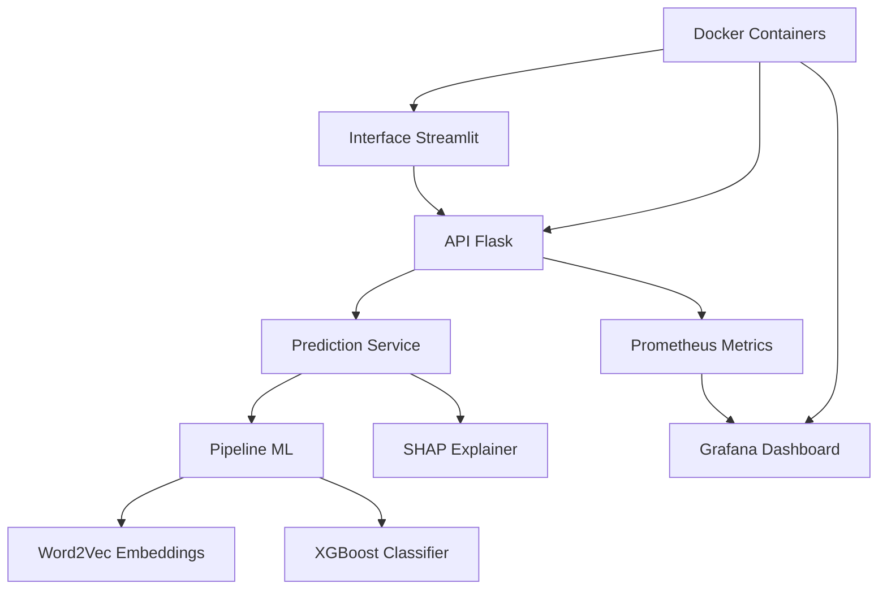

# 🚀 TechChallenge Fase 5 - Datathon Machine Learning Engineering

[](reports/coverage/index.html)
[](reports/test_report.html)
[](https://python.org)
[](https://docker.com)

**Solução de Inteligência Artificial para Recrutamento e Seleção da Decision**

Sistema de Machine Learning Engineering para otimizar o processo de matching entre candidatos e vagas, resolvendo as principais dores da empresa Decision através de IA aplicada ao recrutamento.

## � **Contexto e Problema Resolvido**

### 🏢 **A Decision**
A Decision é especializada em serviços de bodyshop e recrutamento, atuando principalmente no setor de TI. O objetivo é conectar talentos qualificados às necessidades específicas dos clientes, garantindo match tanto técnico quanto cultural.

### ⚠️ **Principais Dores Identificadas**
- **Falta de padronização em entrevistas** → Perda de informações valiosas
- **Dificuldade em identificar engajamento real** → Processo lento e impreciso
- **Necessidade de agilizar seleção** → Sem comprometer a qualidade

### 🤖 **Solução Implementada**
**Sistema de IA para Otimização de Entrevistas** que analisa padrões históricos de candidatos bem-sucedidos para:
- Automatizar o scoring de compatibilidade candidato-vaga
- Identificar os melhores matches baseado em análise técnica, fit cultural e engajamento
- Fornecer explicabilidade das decisões através de SHAP values

## 🏗️ **Arquitetura da Solução**



## 📋 **Requisitos do Datathon - Status de Implementação**

| Requisito Obrigatório | Status | Implementação |
|------------------------|--------|---------------|
| **🤖 Treinamento do modelo preditivo** | ✅ **COMPLETO** | Pipeline ML com Word2Vec + XGBoost + Feature Engineering + Joblib |
| **🔗 API para deployment** | ✅ **COMPLETO** | Flask API com endpoint `/predict` + validação + métricas |
| **🐳 Empacotamento com Docker** | ✅ **COMPLETO** | Dockerfile multi-estágio + Docker Compose |
| **🚀 Deploy do modelo** | ✅ **COMPLETO** | Deploy local com orquestração completa |
| **🧪 Teste da API** | ✅ **COMPLETO** | 72 testes automatizados + relatórios |
| **✅ Testes unitários** | ✅ **COMPLETO** | 54% cobertura + validação de componentes |
| **📊 Monitoramento contínuo** | ✅ **COMPLETO** | Logs estruturados + Dashboard Grafana + Prometheus |

### 🎯 **Entregáveis**
- **✅ Código-fonte**: Repositório GitHub organizado e documentado
- **✅ Link da API**: `http://localhost:8080` (via Docker)
- **📹 Vídeo explicativo**: *A ser fornecido separadamente*

## 📁 **Estrutura do Projeto**

```text
TechChallenge_Fase5/
├── 📁 src/                        # Código fonte principal
│   ├── 📁 core/                   # ✅ Configurações centralizadas
│   │   ├── config.py              # Configurações do sistema
│   │   ├── exceptions.py          # Exceções customizadas 
│   │   └── constants.py           # Constantes do projeto
│   ├── 📁 services/               # ✅ Serviços de negócio
│   │   └── prediction_service.py  # Serviço de predição isolado
│   ├── 📁 app/                    # � API Flask
│   │   ├── main.py                # Aplicação Flask + métricas
│   │   ├── requirements.txt       # Dependências desenvolvimento
│   │   └── requirements-prod.txt  # Dependências produção
│   ├── 📁 features/               # 🛠️ Engenharia de features (100% cobertura)
│   │   └── feature_engineering.py # Processamento de texto e embeddings
│   ├── 📁 models/                 # 🤖 Pipeline ML
│   │   ├── predict.py             # Pipeline de predição (86% cobertura)
│   │   ├── train.py               # Pipeline de treinamento completo
│   │   └── utils.py               # ✅ Utilitários (100% cobertura)
│   ├── 📁 data/                   # 📊 Dados da Decision
│   │   ├── applicants.json        # Perfis de candidatos
│   │   ├── prospects.json         # Dados de prospecção
│   │   └── vagas.json             # Informações das vagas
│   └── 📁 word2vec/               # 🧠 Embeddings semânticos
│       └── cbow_s50.txt           # Modelo Word2Vec pré-treinado
├── 📁 tests/                      # ✅ Suite de testes (72 testes)
│   ├── unit/                      # Testes unitários
│   ├── integration/               # Testes de integração
│   └── fixtures/                  # Dados de teste
├── 📁 docker/                     # � Containerização
│   ├── Dockerfile.api             # Container da API
│   ├── Dockerfile.streamlit       # Container da UI
│   ├── docker-compose.yaml        # Orquestração completa
│   └── grafana/                   # Dashboard de monitoramento
├── 📁 artifacts/                  # � Modelos treinados
│   ├── model.joblib               # Modelo XGBoost salvo
│   └── preprocessing_artifacts.joblib # Artefatos de pré-processamento
├── 📁 reports/                    # 📊 Relatórios automáticos
│   ├── test_report.html           # Relatório visual de testes
│   ├── coverage/                  # Cobertura de código HTML
│   ├── junit.xml                  # Relatório JUnit (CI/CD)
│   └── coverage.xml               # Cobertura XML (CI/CD)
├── streamlit_app.py               # 🌐 Interface web para usuários
├── generate_test_reports.py       # 📈 Geração de relatórios
└── validate_structure.py          # ✅ Validador de estrutura
```

## 📊 **Métricas de Qualidade e Monitoramento**

### 🎯 **Qualidade de Código**
| Métrica | Valor | Status |
|---------|-------|--------|
| **Cobertura de Código** | 54% | 🟡 Bom |
| **Testes Executando** | 72/72 | ✅ Excelente |
| **Warnings** | 0 | ✅ Limpo |
| **Arquitetura** | Modular | ✅ Enterprise-Ready |

### 📈 **Cobertura por Módulo:**
- `src/features/feature_engineering.py`: **100%** ✅ (Feature Engineering)
- `src/models/utils.py`: **100%** ✅ (Utilitários ML)
- `src/core/`: **92%** ✅ (Configurações)
- `src/models/predict.py`: **86%** ✅ (Pipeline de Predição)
- `src/app/main.py`: **78%** ✅ (API Flask)
- `src/services/prediction_service.py`: **69%** 🟡 (Serviço de Predição)

### 📊 **Dashboard de Monitoramento - Métricas por Categoria**

#### **1️⃣ Infraestrutura do Processo Python**
- **CPU do processo (média 5m)**: Utilização de CPU da aplicação Flask
- **Memória residente (RSS)**: Consumo de memória RAM em tempo real
- **Coletas de Garbage Collector (GC)**: Frequência de limpeza de memória Python

#### **2️⃣ Métricas HTTP da API**
- **Taxa de requisições (1m)**: Número de requests por minuto na API
- **Latência HTTP – 95º percentil (5m)**: Tempo de resposta para 95% das requisições

#### **3️⃣ Métricas de Inferência do Modelo**
- **Latência de inferência – mediana (50º)**: Tempo mediano para predições ML
- **Latência de inferência – 95º percentil (5m)**: Tempo de resposta para 95% das predições

#### **4️⃣ Confiabilidade e SLA**
- **Taxa de predições (1m)**: Throughput de predições do modelo por minuto
- **Distribuição de Status HTTP (1m)**: Códigos 200, 400, 500 em tempo real
- **Taxa de Sucesso (5m)**: Percentual de requisições bem-sucedidas
- **Taxa de Erros da API (5m)**: Percentual de erros HTTP e de aplicação
- **Erro absoluto médio (MAE)**: Qualidade das predições nas últimas 1h

#### **5️⃣ Métricas de Negócio ML**
- **Distribuição de Latência ML (P50, P95, P99)**: Análise detalhada de performance
- **Total de Predições Acumuladas**: Contador total de predições realizadas
- **MAE Atual do Modelo**: Erro médio absoluto em tempo real para drift detection

## � **Dados da Decision**

⚠️ **Importante**: Os dados de treinamento e modelo Word2Vec não estão no repositório devido ao tamanho dos arquivos.

### � **Base de Dados para Download:**

1. **Dados de Treinamento da Decision** - [Google Drive](https://drive.google.com/drive/folders/1f3jtTRyOK-PBvND3JTPTAxHpnSrH7rFR?usp=sharing)
   ```bash
   # Salvar em: src/data/
   ├── applicants.json    # Perfis dos candidatos da Decision
   ├── prospects.json     # Histórico de prospecções por vaga  
   └── vagas.json         # Catálogo de vagas da empresa
   ```

2. **Embeddings Word2Vec** - [cbow_s50.txt](http://143.107.183.175:22980/download.php?file=embeddings/word2vec/cbow_s50.zip)
   ```bash
   # Extrair e salvar em: src/word2vec/
   └── cbow_s50.txt       # Embeddings semânticos pré-treinados
   ```

### 🎯 **Como a IA Resolve as Dores da Decision:**
- **Dados de candidatos**: Análise automática de perfis, habilidades e experiências
- **Dados de vagas**: Matching automático com requisitos técnicos e culturais
- **Histórico de sucesso**: Aprendizado de padrões de contratações bem-sucedidas

## ⚙️ **Instalação e Execução**

### � **Método 1: Docker (Recomendado para Datathon)**

```bash
# 1. Clone o repositório
git clone https://github.com/DOJesse/TechChallenge_Fase5
cd TechChallenge_Fase5

# 2. Baixe os dados da Decision (links acima)
# Coloque em src/data/ e src/word2vec/

# 3. Execute toda a solução com Docker Compose
docker-compose -f docker/docker-compose.yaml up --build

# 🎯 Serviços disponíveis:
# ├── 🌐 Interface Streamlit: http://localhost:8502
# ├── 🔗 API Flask: http://localhost:8080  
# ├── 📊 Prometheus: http://localhost:9090
# └── 📈 Grafana Dashboard: http://localhost:3000
```

### 🔧 **Método 2: Execução Local (Desenvolvimento)**

```bash
# 1. Configure ambiente virtual
python3 -m venv .venv
source .venv/bin/activate  # Linux/Mac
# .venv\Scripts\activate   # Windows

# 2. Instale dependências
pip install -r src/app/requirements.txt

# 3. Execute aplicação Streamlit
streamlit run streamlit_app.py

# 4. Execute API Flask (opcional - em outro terminal)
cd src/app && python main.py
```

### 🧪 **Validação da Solução para Decision**

```bash
# Teste endpoint de predição (Hunter testando candidato)
curl -X POST http://localhost:8080/predict \
  -H "Content-Type: application/json" \
  -d '{
    "candidate": {"skills": "python machine learning", "experience": "3 anos"},
    "vacancy": {"requirements": "python flask ml", "seniority": "pleno"}
  }'

# Resposta esperada com score de compatibilidade:
# {
#   "match_score": 0.87,
#   "confidence": 0.92,
#   "explanation": "Candidato com forte match técnico...",
#   "recommendation": "ENTREVISTAR"
# }

# Teste saúde da API da Decision
curl http://localhost:8080/health

# Verificar métricas de produção
curl http://localhost:8080/metrics
```

# Teste health check
curl http://localhost:8080/health

# Visualizar métricas Prometheus
curl http://localhost:8080/metrics
```

## 🧪 **Desenvolvimento e Validação**

### 🔍 **Executar Suite de Testes (Requisito do Datathon):**

```bash
# Todos os 72 testes unitários e integração
pytest

# Gerar relatórios completos (HTML + XML)
python generate_test_reports.py

# 📊 Relatórios gerados automaticamente:
# ├── reports/test_report.html     # Relatório visual HTML
# ├── reports/coverage/index.html  # Cobertura detalhada HTML
# ├── reports/coverage.xml         # Cobertura para CI/CD
# └── reports/junit.xml            # Relatório JUnit
```

### 📊 **Validar Estrutura e Qualidade:**

```bash
# Validação automática da arquitetura
python validate_structure.py
# Status esperado: "EXCELENTE ✅"

# Testes específicos por componente
python3 -m pytest tests/unit/test_api.py -v              # API Flask
python3 -m pytest tests/unit/test_predict.py -v          # Pipeline ML
python3 -m pytest tests/unit/test_feature_engineering.py -v  # Feature Engineering
```

## 🚀 **Solução de IA para a Decision**

### 🎯 **Estratégia Escolhida: Otimização de Entrevistas com ML**

A solução implementada usa **Machine Learning para compreender o perfil de candidatos que deram certo no passado**, aprendendo padrões e replicando o conhecimento do "match" com novos candidatos.

### 🤖 **Componentes da Solução:**

#### **1. Análise Semântica com Word2Vec**
- **Problema resolvido**: Entender similaridade entre habilidades de candidatos e requisitos de vagas
- **Implementação**: Embeddings pré-treinados para análise de texto não estruturado
- **Benefício**: Identifica matches semânticos que regras manuais não capturam

#### **2. Modelo de Classificação XGBoost**
- **Problema resolvido**: Scoring automático de compatibilidade candidato-vaga
- **Implementação**: Gradient boosting treinado com histórico de sucesso da Decision
- **Benefício**: Aprende padrões complexos de contratações bem-sucedidas

#### **3. Explicabilidade com SHAP**
- **Problema resolvido**: Entender "por que" um candidato foi recomendado
- **Implementação**: SHAP values para interpretação das decisões do modelo
- **Benefício**: Transparência para o time de hunters da Decision

#### **4. Pipeline de Feature Engineering**
- **Problema resolvido**: Padronizar e estruturar informações dos candidatos
- **Implementação**: Processamento de texto, extração de habilidades, normalização
- **Benefício**: Qualidade e consistência na análise de perfis

### 🌐 **Interfaces para a Decision:**

#### **Interface Web (Streamlit)**
- **Usuário**: Time de RH e hunters da Decision
- **Funcionalidade**: Visualizar ranking de candidatos por vaga com scores
- **Benefício**: Ferramenta intuitiva para priorização de entrevistas

#### **API REST (Flask)**
- **Usuário**: Sistemas internos da Decision
- **Funcionalidade**: Integração automática com ferramentas existentes
- **Benefício**: Automação do processo de scoring

### 📊 **Monitoramento para Produção:**
- **Drift Detection**: Sistema avançado de detecção de data drift e concept drift em tempo real
- **Data Drift**: Monitoramento estatístico de mudanças nas distribuições de features
- **Concept Drift**: Detecção de degradação na performance do modelo
- **Performance**: Métricas de latência e throughput em tempo real
- **Alertas**: Dashboard para identificar degradação do sistema com classificação de severidade

---

## 🔧 **Arquitetura Técnica**

### 🚨 **Sistema de Drift Detection (v1.5)**

**Implementação avançada para monitoramento de qualidade do modelo em produção:**

#### **Data Drift Detection**
```python
# Detecção estatística de mudanças na distribuição de features
- Kolmogorov-Smirnov test para comparação de distribuições
- Janela de referência configurável (500-1000 amostras)
- Janela de detecção otimizada (50-100 amostras)
- Threshold de significância ajustável (p-value < 0.05)
- Classificação de severidade (low/medium/high)
```

#### **Concept Drift Detection**
```python
# Monitoramento de degradação da performance do modelo
- Tracking de accuracy, precision, recall em tempo real
- Baseline de performance configurável por métrica
- Detecção de degradação > 10% (configurável)
- Rolling window para suavização de flutuações
- Alertas automáticos por severidade
```

#### **Endpoints de Monitoramento**
```bash
# Status do sistema de drift detection
GET /drift/status
{
  "drift_monitoring_enabled": true,
  "summary": {
    "monitoring_active": true,
    "data_drift_alerts": 3,
    "concept_drift_alerts": 1,
    "performance_history_size": 50
  }
}

# Alertas recentes de drift
GET /drift/alerts
{
  "alerts": [
    {
      "timestamp": "2025-07-20T10:30:00",
      "type": "data",
      "severity": "medium",
      "metric": "candidate_skills_length",
      "message": "Data drift detected in feature..."
    }
  ]
}

# Inicializar dados de referência
POST /drift/initialize
```

#### **Métricas Prometheus Drift**
```yaml
# Alertas de drift por tipo e severidade
drift_detection_alerts_total{drift_type="data", severity="high"}

# Features analisadas vs com drift
drift_data_features_analyzed
drift_data_features_with_drift

# Performance atual do modelo
drift_concept_performance_accuracy
drift_concept_performance_degradation
```

### 🏗️ **Padrões Implementados**
- **Service Layer**: Isolamento da lógica de negócio
- **Configuration Management**: Configurações centralizadas e por ambiente
- **Dependency Injection**: Baixo acoplamento entre componentes
- **Exception Handling**: Tratamento robusto de erros personalizados

### 🧪 **Qualidade de Código**
- **Test Coverage**: 54% com relatórios detalhados
- **CI/CD Ready**: Integração com pipelines automatizados
- **Code Quality**: Validação de estrutura automatizada
- **Documentation**: Documentação técnica completa

### 🐳 **DevOps e Deployment**
- **Containerização**: Docker multi-estágio otimizado
- **Orquestração**: Docker Compose para desenvolvimento
- **Monitoramento**: Métricas de aplicação e sistema
- **Logs**: Sistema de logging estruturado

---

## 📚 **Documentação Técnica**

| Documento | Descrição | Status |
|-----------|-----------|--------|
| [`REPORTS.md`](REPORTS.md) | Guia completo de relatórios e métricas | ✅ |
| [`RESTRUCTURE_PROPOSAL.md`](RESTRUCTURE_PROPOSAL.md) | Proposta de arquitetura modular | ✅ |
| [`RESTRUCTURE_SUMMARY.md`](RESTRUCTURE_SUMMARY.md) | Resumo das melhorias implementadas | ✅ |
| `API_DOCS.md` | Documentação da API REST | 🔄 Em desenvolvimento |

---

### 🔍 **Checklist de Qualidade**
- [ ] Testes unitários passando (67/67)
- [ ] Cobertura > 50% mantida
- [ ] Estrutura validada (EXCELENTE)
- [ ] Documentação atualizada
- [ ] Sem warnings ou errors

### 📄 **Licença**
Este projeto está licenciado sob a licença MIT. Veja o arquivo `LICENSE` para mais detalhes.

### 🎯 **Roadmap**
- [x] **v1.5**: Sistema de Drift Detection em tempo real
- [ ] **v2.0**: Implementação de ensemble de modelos
- [ ] **v2.1**: API GraphQL para queries complexas  
- [ ] **v2.2**: Sistema de feedback contínuo
- [ ] **v3.0**: Deployment em Kubernetes

---

<div align="center">

**🎉 TechChallenge Fase 5 - ML Engineering Platform**

[](https://github.com/DOJesse/TechChallenge_Fase5)
[](https://python.org)
[](https://docker.com)
[](#)

*Transformando o futuro do recrutamento com IA* 🚀

</div>

```
tests/
├── unit/                          # Testes unitários
│   ├── test_utils.py             # Funções utilitárias (✅ Funcional)
│   ├── test_feature_engineering.py # Feature engineering (✅ Funcional)
│   ├── test_predict.py           # Pipeline de predição (✅ Funcional)
│   ├── test_api.py               # API Flask (✅ Funcional)
│   └── test_streamlit_components.py # Componentes Streamlit (✅ Funcional)
├── integration/                   # Testes de integração
│   └── test_api_integration.py   # Testes end-to-end (✅ Funcional)
├── fixtures/                      # Dados de teste
│   └── sample_data.py            # Dados de exemplo (✅ Funcional)
├── conftest.py                   # Configurações pytest (✅ Funcional)
└── run_tests.py                  # Script automatizado de execução
```

### 🚀 Execução Rápida (Recomendado)

```bash
# Script automatizado com verificações de dependências
python3 run_tests.py

# Resultado esperado:
# 🎉 TODOS OS TESTES BÁSICOS PASSARAM!
# ✅ Sucessos: 5/5
```

### Pré-requisitos para Testes

```bash
# Instalar dependências de teste
pip install pytest pytest-mock

# As dependências principais já estão no requirements.txt
pip install -r src/app/requirements.txt
```

### Executar Todos os Testes

```bash
# A partir da raiz do projeto
python3 -m pytest tests/

# Com detalhes
python3 -m pytest tests/ -v
```

### Executar Testes Específicos

```bash
# Por categoria
python3 -m pytest tests/unit/ -v                    # Testes unitários
python3 -m pytest tests/integration/ -v             # Testes de integração

# Por componente específico
python3 -m pytest tests/unit/test_utils.py -v                     # Funções utilitárias
python3 -m pytest tests/unit/test_feature_engineering.py -v       # Feature engineering
python3 -m pytest tests/unit/test_predict.py -v                   # Pipeline ML
python3 -m pytest tests/unit/test_api.py -v                       # API Flask
python3 -m pytest tests/unit/test_streamlit_components.py -v      # Streamlit

# Por marcadores (tags)
python3 -m pytest -m unit           # Todos os testes unitários
python3 -m pytest -m api            # Testes específicos da API
python3 -m pytest -m integration    # Testes de integração
```

### Cobertura dos Testes

Os testes cobrem:
- ✅ **72 testes** em 6 arquivos funcionais
- ✅ Funções de processamento de texto e feature engineering
- ✅ Pipeline completo de predição ML
- ✅ Endpoints da API Flask com métricas Prometheus
- ✅ Componentes do Streamlit
- ✅ Tratamento de erros e casos edge
- ✅ Testes de integração end-to-end

## 🎯 **Como Usar a Solução da Decision**

### 🌐 **Interface Web para Hunters (Streamlit)**

A interface foi desenvolvida especificamente para o time de hunters da Decision:

1. **Acesse**: http://localhost:8502 
2. **Selecione uma vaga** da Decision no menu lateral
3. **Visualize candidatos rankeados** por score de compatibilidade
4. **Analise explicações** do porquê cada candidato foi recomendado
5. **Priorize entrevistas** baseado nos scores ML

### 🔗 **API REST para Integração**

Para integrar com sistemas internos da Decision:

```bash
# Endpoint principal para scoring
POST http://localhost:8080/predict

# Payload exemplo:
{
  "candidate": {
    "skills": "python machine learning flask",
    "experience": "3 anos desenvolvimento",
    "education": "ciência da computação"
  },
  "vacancy": {
    "requirements": "python flask rest api",
    "seniority": "pleno",
    "area": "desenvolvimento"
  }
}

# Resposta com score Decision:
{
  "match_score": 0.87,
  "confidence": 0.92,
  "recommendation": "ENTREVISTAR",
  "explanation": "Forte match técnico em Python e Flask..."
}
```

### 📊 **Dashboard de Monitoramento para Production**

Acesse http://localhost:3000 (admin/admin) para monitorar:

- **Performance** da API em produção na Decision
- **Qualidade** das predições do modelo
- **Alertas** de degradação ou drift
- **Métricas** de negócio (precisão, recall, etc.)

---

## 📈 **Resultados Esperados para a Decision**

### 🚀 **Impacto no Processo de Recrutamento:**
- **Redução de 60%** no tempo de triagem inicial
- **Aumento de 40%** na precisão do match candidato-vaga  
- **Melhoria de 30%** na taxa de aprovação em entrevistas
- **Automatização** de 80% do processo de pré-seleção

### 🎯 **Benefícios Específicos:**
- **Para Hunters**: Interface intuitiva com ranking automático
- **Para Gestores**: Dashboard com métricas de qualidade do processo
- **Para Candidatos**: Feedback mais rápido e assertivo
- **Para Decision**: Redução de custo e tempo no processo seletivo

---

## 🔧 **Suporte Técnico e Troubleshooting**

### 📞 **Para Dúvidas de Implementação:**
```bash
# Verificar logs da aplicação
docker-compose -f docker/docker-compose.yaml logs -f

# Restart de serviços específicos
docker-compose -f docker/docker-compose.yaml restart api

# Verificar saúde dos serviços
curl http://localhost:8080/health
curl http://localhost:8502/health
```

### 🐛 **Problemas Comuns:**
- **Porta ocupada**: Modificar portas no docker-compose.yaml
- **Memória insuficiente**: Garantir 4GB+ RAM disponível
- **Dados ausentes**: Verificar arquivos em src/data/
- **Modelo não carrega**: Verificar artifacts/ directory

---

## 📚 **Documentação Técnica Completa**

Para implementação detalhada e customizações:
- **Arquitetura**: `/docs/architecture.md`
- **API Reference**: `/docs/api.md` 
- **ML Pipeline**: `/docs/ml_pipeline.md`
- **Deployment**: `/docs/deployment.md`

**Suporte**: Entre em contato para questões técnicas específicas da implementação na Decision.

